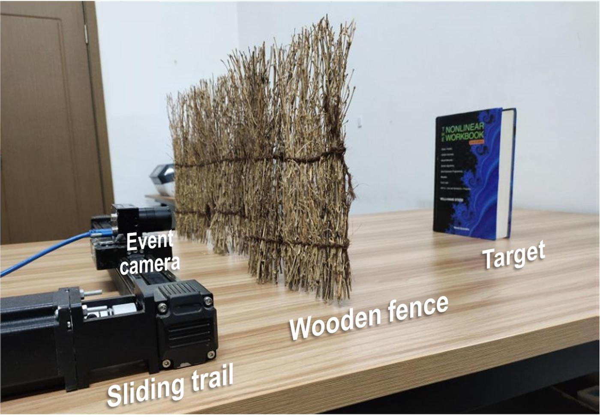
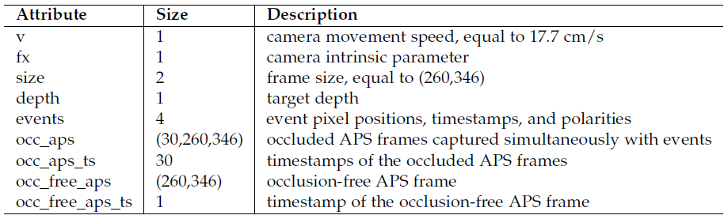

# E-SAI
### [Official Website](https://dvs-whu.cn/projects/esai/) for Learning to See Through with Events.

Although synthetic aperture imaging (SAI) can achieve the seeing-through effect by blurring out off-focus foreground occlusions while recovering in-focus occluded scenes from multi-view images, its performance is often deteriorated by very dense occlusions and extreme lighting conditions. To address the problem, this paper presents an Event-based SAI (E-SAI) method by relying on the asynchronous events with extremely low latency and high dynamic range acquired by an event camera. 
Specifically, the collected events are first refocused by a Refocus-Net module through aligning in-focus events while scattering out off-focus ones. Following that, a hybrid network composed of spiking neural networks (SNNs) and convolutional neural networks (CNNs) is proposed to encode the spatio-temporal information from the refocused events and reconstruct a visual image of the occluded targets.


Exhaustive experiments demonstrate that our proposed E-SAI method can achieve remarkable performance in dealing with very dense occlusions and extreme lighting conditions and produce high-quality images from pure event data.

Previous version has been published in CVPR'21 [**Event-based Synthetic Aperture Imaging with a Hybrid Network**](https://openaccess.thecvf.com/content/CVPR2021/html/Zhang_Event-Based_Synthetic_Aperture_Imaging_With_a_Hybrid_Network_CVPR_2021_paper.html), which is selected as one of the Best Paper Candidates.


## Environment setup
- Python 3.6
- Pytorch 1.6.0
- torchvision 0.7.0
- opencv-python 4.4.0
- NVIDIA GPU + CUDA
- numpy, argparse, matplotlib
- [sewar](https://github.com/andrewekhalel/sewar), [lpips](https://github.com/richzhang/PerceptualSimilarity) (for evaluation, optional)

You can create a new [Anaconda](https://www.anaconda.com/products/individual) environment with the above dependencies as follows.
<br>
Please make sure to adapt the CUDA toolkit version according to your setup when installing torch and torchvision.
```
conda create -n esai python=3.6
conda activate esai
pip install torch==1.6.0+cu101 torchvision==0.7.0+cu101 -f https://download.pytorch.org/whl/torch_stable.html
pip install -r requirements.txt
```

## SAI dataset
We construct a new SAI dataset containing 588 pairs of data in both indoor and outdoor environments. We install the DAVIS346 camera on a programmable sliding trail and employ a dense wooden fence to imitate the densely occluded scenes. When the camera moves linearly on the sliding trail, the triggered events can be collected from different viewpoints, and the occluded frames are captured simultaneously by the DAVIS346 camera. For each pair of data, an occlusion-free frame is also provided as ground truth image.

<div align=center>  </div>

All the data are released as python (npy) files, and each pair of data contains the following information:

<div align=center>  </div>

Feel free to download our [**SAI dataset**](https://drive.google.com/drive/folders/1JVA06QYaQwG88BcAIJwjUGjyItR_UDjC?usp=sharing) (3.46 G). You are also welcome to check out our [**EF-SAI**](https://github.com/smjsc/EF-SAI) dataset via [**One Drive**](https://onedrive.live.com/?authkey=%21AMvAPOnuudsYx1I&id=7ABD0A750B262518%214850&cid=7ABD0A750B262518) or [**Baidu Net Disk**](https://pan.baidu.com/s/1VKbt0hoh44Ax7QX4sblBKQ?pwd=3tgv#list/path=%2F).

## Quick start
### Download model and data
Pretrained model can be downloaded via [**Google Drive**](https://drive.google.com/drive/folders/10TOO9US1zkABXIqtvZRXWJU7Y4HBp6nB?usp=sharing). Note that the network structure is slightly different from the model in our CVPR paper.
<br>
We provide some [**example data**](https://drive.google.com/drive/folders/1_cNicsiyGy9EsqeuCNXLp3zxh-vubEgC?usp=sharing) from the SAI dataset here for quick start.

### Initialization
Change the parent directory to './codes/'
```
cd codes
```
- Create directories
```
mkdir -p PreTraining Results Example_data/{Raw,Processed}
```
- Copy the pretrained model to directory './PreTraining/'
- Copy the example data to directories './Example_data/Raw/'

### E-SAI+Hybrid (M)
Run E-SAI+Hybrid with manual refocusing module.
- Preprocess event data with manual refocusing
```
python Preprocess.py --do_event_refocus=1 --input_path=./Example_data/Raw/ --save_path=./Example_data/Processed-M/
```
- Run reconstruction (using only HybridNet)
```
python Test_ManualRefocus.py --reconNet=./PreTraining/Hybrid.pth --input_path=./Example_data/Processed-M/ --save_path=./Results-M/
```
The reconstruction results will be saved at save_path (default: './Results-M/').

### E-SAI+Hybrid (A)
Run E-SAI+Hybrid with auto refocusing module.
- Preprocess event data without refocusing
```
python Preprocess.py --do_event_refocus=0 --input_path=./Example_data/Raw/ --save_path=./Example_data/Processed-A/
```
- Run reconstruction (using HybridNet and RefocusNet)
```
python Test_AutoRefocus.py --reconNet=./PreTraining/Hybrid.pth --refocusNet=./PreTraining/RefocusNet.pth --input_path=./Example_data/Processed-A/ --save_path=./Results-A/
```
The reconstruction results will be saved at save_path (default: './Results-A/'). 
<br>
This code will also calculate the Average Pixel Shift Error (APSE) and save the result in './Results-A/APSE.txt'.

### Evaluation
Evaluate the reconstruction results with metrics PSNR, SSIM and LPIPS.
- If you want to evaluate the results on the particular data such as E-SAI+Hybrid (M) results on the example data, run evaluation
```
python Evaluation.py --input_path=./Results-M/
```
This code will create an IQA.txt file containing the quantitative results in './Results-M/IQA.txt'.
- If you want to evaluate on the whole SAI dataset, please arrange the results as follows
```
<project root>
  |-- Results
  |     |-- Indoor
  |     |     |-- Object 
  |     |     |-- Portrait
  |     |     |-- Picture
  |     |-- Outdoor
  |     |     |-- Scene
```
Under each category folder, please put the reconstruction results and the corresponding gt images in 'Test' and 'True' directories, respectively. For example,
```
<project root>
  |-- Results
  |     |-- Outdoor
  |     |     |-- Scene
  |     |     |     |-- Test
  |     |     |     |     |-- 000000.png
  |     |     |     |     |-- 000001.png
  |     |     |     |     |-- ...
  |     |     |     |-- True
  |     |     |     |     |-- 000000.png
  |     |     |     |     |-- 000001.png
  |     |     |     |     |-- ...
```
Then run 
```
python Evaluation_SAIDataset.py --indoor_path=./Results/Indoor/ --outdoor_path=./Results/Outdoor/
```
The quantitative results will be printed in terminal and recorded in IQA.txt file. Note that we use center cropped 256x256 images for evaluation in our paper.

## Citation

If you find our work useful in your research, please cite:

```
@inproceedings{zhang2021event,
  title={Event-based Synthetic Aperture Imaging with a Hybrid Network},
  author={Zhang, Xiang and Liao, Wei and Yu, Lei and Yang, Wen and Xia, Gui-Song},
  year={2021},
  booktitle={CVPR},
}
```
